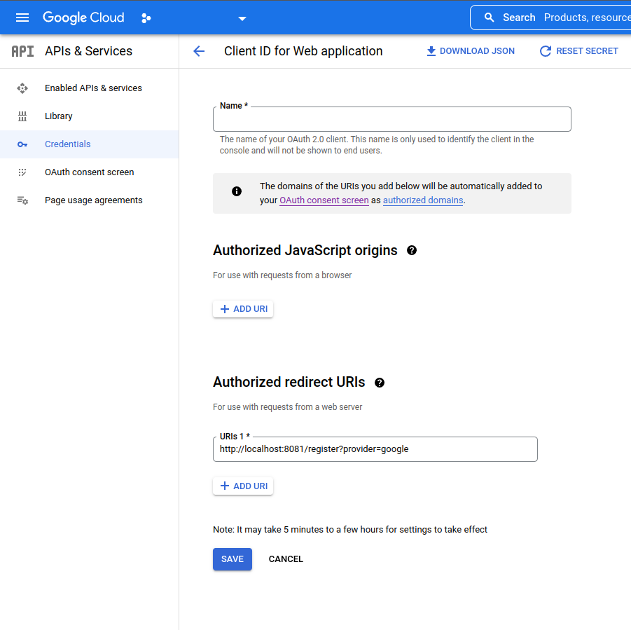

## Introduction
<p>You need to configure your oauth2 settings on provider's page. Google oauth credential example above.</p>



## Usage
<p>Implementation is very similar at any framework or pure http package. You only need to initiate sso provider struct correct and rest of will be fine.
An example wrote above to understand how this package can be used.
</p>

### Fiber Framework
<p>Register as context, use everywhere</p>

 ```go
    var (
        oauthClient oauthclient.Client
        oauthConfig oauth_client.AuthConfig	
    )
    // ... initiate oauthConfig and oauthClient variables.
    app.Use(func(c *fiber.Ctx) error {
		var (
			oauthGoogleProcessor = oauth.NewOAuthProcessor(s.oauthClient, s.oauthConfig.Google)
			oauthGoogle          = sso.NewStrategyProxy(strategies.NewGoogleSSO(oauthGoogleProcessor))
	
			oauthGithubProcessor = oauth.NewOAuthProcessor(s.oauthClient, s.oauthConfig.Github)
			oauthGithub          = sso.NewStrategyProxy(strategies.NewGithubSSO(oauthGithubProcessor))
		)
	
		c.Locals(oauth.GithubCtx, oauthGithub)
		c.Locals(oauth.GoogleCtx, oauthGoogle)
	
		return c.Next()
	})
 ```

<p>Handler</p>

```go
type AuthHandler interface {
    LoginGithub(c *fiber.Ctx) error
    LoginGoogle(c *fiber.Ctx) error
    Register(c *fiber.Ctx) error
}

type authHandler struct {
    oauthStrategy sso.StrategySelector
}

func NewAuthHandler(oauth sso.StrategySelector) AuthHandler {
    return &authHandler{
        oauthStrategy: oauth
    }
}

func (h *authHandler) LoginGithub(c *fiber.Ctx) error {
	var (
		oauthGithub = oauthutil.Github(c.Context())
		url, err    = h.oauthStrategy.Set(oauthGithub).Login()
	)

	if err != nil {
		return c.SendStatus(fiber.StatusNotFound)
	}

	return c.Redirect(url, fiber.StatusTemporaryRedirect)
}

func (h *authHandler) LoginGoogle(c *fiber.Ctx) error {
	var (
		oauthGoogle = oauthutil.Google(c.Context())
		url, err    = h.oauthStrategy.Set(oauthGoogle).Login()
	)

	if err != nil {
		return c.SendStatus(fiber.StatusNotFound)
	}

	return c.Redirect(url, fiber.StatusTemporaryRedirect)
}
```

<p>Register function</p>

```go
func (h *authHandler) Register(c *fiber.Ctx) error {
	var (
		cb  oauth.CallbackResponse
		ctx = c.Context()
		err = c.QueryParser(&cb)
	)
	
	if err != nil {
		log.Println("[INFO]", err)
		return c.SendStatus(http.StatusNotFound)
	}
	
	var res, rErr = h.oauthStrategy.SetByCtx(ctx, cb.Provider).Register(ctx, cb)
	if rErr != nil {
		return c.SendStatus(http.StatusNotFound)
	}
	
	return c.JSON(res)
}
```

<p>To test your register endpoint, you'll have to visit <code>localhost:xx/register?provider={yourProvider}</code></p>

<h3>Available providers</h3>

- [x] Google
- [x] Github
